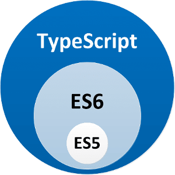

This is my very first post on internet as someone who calls themself a ‘developer’. I’m a undergraduate student yet, but I had my time working and I intend to share more my learning path than this thin experience.
So, to start sharing this path, I decided to talk about my most recent passion: [Typescript](https://www.typescriptlang.org/). For those who don’t know it yet I will use the definition from the language [repository](https://github.com/Microsoft/TypeScript) on github, which I rarely see used but find more interesting:

> TypeScript is a language for application-scale JavaScript. TypeScript adds optional types, classes, and modules to JavaScript.

And how Typescript accomplishs that? Now enter the more used (and tecnical) definition of the language: Typescript is a superset of Javascript, adding the above mentioned qualities to the toolbox of the developer, without loosing performance, because it is compiled to Javascript and, in case of front-end use, gaining compatability with most browsers, since it targets a configurable version of Javascript, allowing you to compile high object-oriented or functional-oriented code to ES5 code.

Therefore, TypeScript is a language of empowerment: gives you tools to right clean and loosely-coupled code, allows you to leverage the npm repository and/or script your solution. With this, it enables the JS world to enter the most distant fields of the Enterprise Software. But even if you are not writing a big and complex company software, I think it will make your experience coding a lot more pleasant.
Ok then, now you have taken a photo of this gigantic world with Hubble and set your coordinates to there. But how can you make this trip? Well, I hear this kind of question a lot and decided to suggest a highway, **not the only one**, but the one that I already take.
When I decided to enter this world I knew a set of languages and had write some softwares (a few I believe still alive), so I didn’t like the “Begginers Course to ~insert some languag here~”, because this type of content is mostly focused _on programming begginers_ not on begginer in a language. Then, the road I took was:

1. Crash Courses: this was perfect, direct to point, show me the code, type of guide for my time and anxiety to build stuff. For who already the logic of conditionals, loops, types, function, objects, yada-yada, this is a huge way to start learning a new language. Take some these courses on JavaScript and Typescript, in the order you desire, and head to the next item. I suggest a excelent youtube channel for this and other content, [Traversy Media](https://www.youtube.com/user/TechGuyWeb).
2. Documentation/Payed Courses/Books: if you liked the language and saw a little of what the ecosystem can offer to you and decided to go ahead, I suggest to get more deep. If you can afford a course on sites like Udemy or book, excelent, choose wisely and you will be in a good way, probably building things and deepen by practice. But if you can’t, no worries, you should to go the oficial documention and try to code the examples of simple projects. In our case, go for the [NodeJS](https://nodejs.org/en/docs/guides/) and [Typescript](https://www.typescriptlang.org/docs/home.html) docs or to the course that myself took on Udemy, [The Complete Node.js Developer Course](https://www.udemy.com/the-complete-nodejs-developer-course-2/).
3. CODE!: I know that for a student learning development the most difficult part is to think in a interesting project to build. I passed for it so many times, and right now I’m full with energy to code because I got some projects. And find then was a sort of luck and simplicity. The first project is a TypeScript package called [config-as-code](https://www.npmjs.com/package/config-as-code), which is really simple but fun to code and born from my needs and experiencie with the two first parts of the road, so look around and solve your little problems with little projects. The second is a side project that I making for the college, which is a awesome place to find people needing help to build some nice and small for a project or academic activity. And the third is a project that I’m working with friends, which is big, so build things together is amazing because you can take larger projects, which has more to offer in terms of learning, without losing courage to continue.

Then I hope to help somebody with ideas to why and how to enter the world of TypeScript. Please, any suggestion on this road feel free to give in comments and expect more posts on this series very soon.

Thank you!
